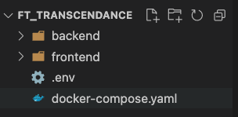
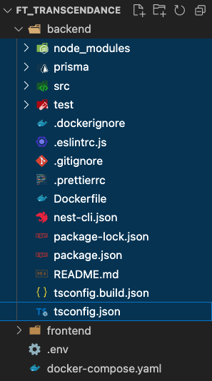
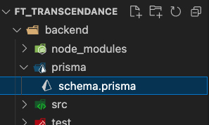

## Table des contenues
- [About](#about)
- [Installation](#installation)
	- [Docker](#docker)
	- [NodeJS](#nodejs)
		- [npm](#nodejs)
		- [yarn](#nodejs)
	- [NestJS](#nestjs)
	- [Angular](#angular)
- [Environnement de dévelopement](#environnement-de-développement)
	- [Back-end](#backend-folder)
		- [Docker](#docker-backend)
		- [Prisma](#prisma---nestjs)
	- [Front-end](#frontend-folder)
	- [Commande Docker](#commande-docker-compose)
## About
Pour ce projet, nous avons choisies d'utiliser différent langage:
- [Angular](#angular) pour le front-end native TypeScript qui ressemble a NestJs
- [NestJS](#nestjs) pour le back-end (On y étais un peux obligées 😅)
- [Prisma](#prisma) pour simplifier la communication entre notre DB et NestJs
- [PostgresSQL](https://www.postgresql.org) comme base de données SQL
- [Docker](https://docs.docker.com/) comme environnement de dévelopement

## Installation Frameworks
### Docker
Il faudra installer la version [Docker](https://docs.docker.com/get-docker/) correspondante à votre OS, sans une installation correct l'environnement de ne fonctionnera pas.

Une fois l'installation de Docker terminer, il faut tester si tous fonctionne bien
```
docker version
```

### NodeJs
[NodeJs](https://nodejs.org/en/) est le composant principale de tous les frameworks utilisé dans ce projet, il confère de nombreuses dépendances indispensable au bon fonctionnement et à la bonne communication entre les services.

Pour son installation il est préférable d'utiliser un package manager:
- [npm](https://docs.npmjs.com/downloading-and-installing-node-js-and-npm) ✅
- [yarn](https://classic.yarnpkg.com/lang/en/docs/install/)

Nous avons choisis npm pour ce projet.
```
node -v
npm -v
```
### NestJs
[NestJS](https://docs.nestjs.com/) est le framework qui va nous permettre de récuperer les données dans notre DB [PostgresSQL](#PostgresSQL) et de les envoyées sous formats http à notre front-end gérer par [Angular](#Angular)
```
	npm i -g @nestjs/cli
	nest --version
```
### Angular
[Angular](https://angular.io/docs) est un framework côté client, open source, basé sur TypeScript, et codirigé par l'équipe du projet « Angular » à Google et par une communauté de particuliers et de sociétés.
```
	npm i @angular/cli
	ng version
```
### Prisma
[Prisma](https://www.prisma.io/) est un ORM qui aide les développeurs d'applications à construire plus rapidement et à faire moins d'erreurs, grâce à son fichier de schéma, il peut générer automatiquement un client qui peut être utilisé dans votre code TypeScript pour interagir avec la base de données.
```
npm install prisma --save-dev
```

Il n'y a pas besoin d'installer [PostgresSQL](https://www.postgresql.org/docs/) Docker s'occupera de sa 😉


## Environnement de développement
Chaque containers sera build à partir des dépendances spécifier dans le fichier package*.json, dans certains cas cela peux créer des conflits lors du montage des images dockers ou lors de la communications des services.
### Copie des fichiers
Dans l'éventualités ou vous auriez déjà implémenter des features coté client et serveur il serait dommage de repartir de zéro, afin d'éviter cela quelque manipulations sont à effectuer, rien de bien méchant je vous rassure 😁

Dans un premier temps il faut que votre ```root``` de votre dossier du projet ressemble à sa 👇🏽


#### Backend folder
Pour le côté serveur, il vous suffira de copier le contenu générer par la commande 👇🏽 dans le dossier ```backend``` 
```
nest new [NAME]
```


Si vous n'avez pas de dossier Prisma, pas d'inquiétude on s'en occupe un peux [plus tard](#prisma---nestjs) 🧐
#### Docker Backend
Nous allons conteneriser notre service backend dans le but de portabilité de notre projet et parce que ```Docker``` c'est cool 😎

Nous aurons besoin pour sa d'un [Dockerfile](https://docs.docker.com/engine/reference/builder/) et d'un [.dockerignore](https://docs.docker.com/engine/reference/builder/#dockerignore-file), vous vous demandez surement pourquoi un ```.dockerignore```, cela va permettre d'éviter de rentrer en conflit entre les ```nodes_modules``` présent sur votre machine et le container, car nous allons mettre en place un système permettant de ne pas build vos ```images docker``` à chaque fois que vous modifier une ligne de code dans votre programme et d'avoir le retour en temps réels des messages du client sur votre terminal, plutôt sympa hein 😃, on vera sa un peux plus tard dans le [docker-compose.yaml](#docker-compose)

Du coup voici à quoi ressemble [Dockerfile](./backend/Dockerfile) dont nous avons besoin pour notre service et voici le [.dockerignore](./backend/.dockerignore)

#### Frontend folder
Dans le même principe que pour le back, il vous suffit de copier votre dossier de travail dans dossier nommé ```frontend```` et le tour et joué 🙃

#### Docker Frontend
Pour le [Dockerfile](./frontend/Dockerfile) est trés similaire car tous ce joue dans le [package.json](./frontend/package.json) au nom des dépendances qui sont installé.

A partir de ce moment là, vous avez configurer le côté client et le côté server, il nous reste à faire communiquer nos services ensemble et sa grâce à [Docker Compose](https://docs.docker.com/compose/) 🫣

## Docker-compose
```Docker Compose``` est un outil permettant de définir et d'exécuter des applications Docker multi-conteneurs. Avec Compose, vous utilisez un fichier YAML pour configurer les services de votre application. Ensuite, avec une seule commande, vous créez et démarrez tous les services à partir de votre configuration.
### docker-compose.yaml
Notre fichier [.yaml](./docker-compose.yaml) va nous permettre de faire communiquer nos différents services entre eux de façon contrôler sans interférer avec les autres services et de façon encapsuler.
#### Service frontend
```build:``` indique à Docker Compose toutes les étapes pour la construction de notre service
```Dockerfile:``` indique le nom du Dockerfile
```context:``` indique le chemin oú le trouver
```target:``` comme nous avons utiliser ```AS```

[IN PROGRESS ...]

#### Prisma <-> NestJs
Si vous ne posséder pas de ```schema.prisma```, vous pouvez utiliser ces commandes afin de générer votre précieux 🤩
```
cd backend
npm install prisma --save-dev
npx prisma init
```
Un dossier ```prisma``` avec un .env on été générer, dans des soucis de ```best pratices docker```, nous allons regrouper les variables environnement dans un seul fichier à la ```root``` de votre projet, puis à terme utilisé le ```secret``` de docker 🤫

Si vous avez déjà un ```schema.prisma``` de prêt sur votre machine, il vous suffira de créer un dossier nommé ```prisma``` et d'y placer
votre fichier



Prochain étape va être d'effectuer une migration de votre schéma prisma

[IN PROGRESS...]


## Commande Docker-compose
### Lancer l'env de dev
	docker-compose up
### Back-end

### Rebuild une image
Il arrive parfois que certains changement telles que les fichiers *.json ne sont pas pris en compte car il sont copié au build de l'image dans ce cas, pensez a rebuild l'image correspondante 

	docker-compose build [image]
